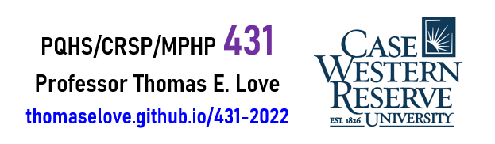
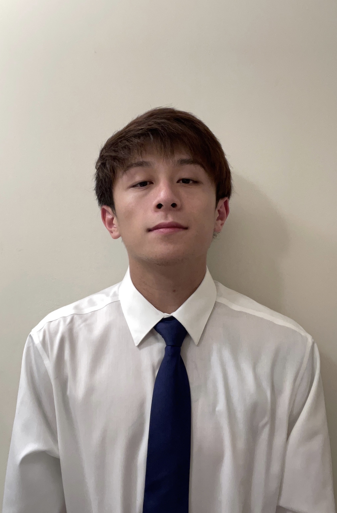
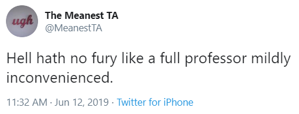

# Welcome! {-}

This is the Fall 2022 syllabus for PQHS / CRSP / MPHP 431: Statistical Methods in Biological & Medical Sciences at Case Western Reserve University with Professor Thomas E. Love.

```{r cwrulogo1-fig, echo = FALSE, fig.align = "center", out.width = '80%'}

```

## Working With This Syllabus {-}

1. This syllabus includes multiple sections. Use the table of contents on the left side of the screen to navigate. 
2. At the top of the syllabus, click the icons to:
    - toggle the table of contents sidebar,
    - search the syllabus, 
    - change the size, font or color scheme of the page, and 
    - download a PDF or Kindle (EPUB) version of the entire syllabus.
3. The syllabus will be updated occasionally. The version listed above shows the most recent update time.

## Who, When and Where? {-}

- The course instructor is [Professor Thomas E. Love][Professor Love]. 
  - Email him at **Thomas dot Love at case dot edu** if you have any questions before class.
- There are several [teaching assistants][Teaching Assistants] helping with the course this semester.
- The course is given on Tuesdays and Thursdays from 1:00 to 2:15 PM Eastern Time, in Room E321-323 in Robbins Hall, within CWRU's School of Medicine, starting on 2022-08-30.

# Getting Started

Your first five steps in this course are to:

1. Register and enroll via the [CWRU Student Information System (SIS)](https://sis.case.edu/).
    - Section 1 of PQHS 431, CRSP 431 and MPHP 431 are identical.
2. Review the [main course website](https://thomaselove.github.io/431-2022/), and be sure to visit the [Course Calendar](https://thomaselove.github.io/431-2022/calendar.html), and skim through the Course Syllabus (this document.)
3. Obtain the [texts required][Required Texts] for the course - see below for details.
4. Complete the [Welcome to 431 survey](https://bit.ly/431-2022-welcome-survey) - see below for details.
5. Get started [installing the software][Required Software] you'll need for the course.

## What Do I Need To Purchase?

You need to buy David Spiegelhalter's **The Art of Statistics**. You can purchase any of the available versions (hard-cover, paperback or e-reader) online or in your local bookstore for about $20.

Everything else (including several other required texts) will be free, and is described in detail in the [Required Texts section][Required Texts] of this Syllabus.

## Welcome to 431 Survey 

Please fill out the [Welcome to 431 Survey](https://bit.ly/431-2022-welcome-survey) at https://bit.ly/431-2022-welcome-survey to help us get to know you a little better.

- Note that you must **log into Google via your CWRU account** in order to access the survey.
- The survey should take 15-20 minutes to complete, and we encourage you to complete it as soon as you can.
  
# The Main Course Web Site

The main course web site is found at https://thomaselove.github.io/431-2022/. 

By the first class, this page will house links to everything we will provide, including:

- The [431 Syllabus](https://thomaselove.github.io/431-syllabus-2022/) (this document)
- Professor Love's Course Notes, the main textbook for the course
- The [Course Calendar](https://thomaselove.github.io/431-2022/calendar.html), which is the final word for all deadlines and assignments
    - The [Calendar](https://thomaselove.github.io/431-2022/calendar.html) also links to materials for each class, including presentation slides and announcements
- [Data (and Code)](https://github.com/THOMASELOVE/431-data) for the course's assignments, presentations, and notes
- Readings and other Supplemental Materials that we'll review during the course
- Our Campuswire discussion forum for questions and answers about R and the course
- Our [Canvas page](https://canvas.case.edu) for turning in assignments and downloading recordings.

## Contact Information

Our main website at https://thomaselove.github.io/431-2022/ includes a **Contact Us page** which provides detailed information on the best ways to get help from [Professor Love][Professor Love] and the [Teaching Assistants][Teaching Assistants] during the semester.

- The course Teaching Assistants will hold regular office hours, begin on 2022-09-06 and end on 2022-12-12, over Zoom, and the schedule for these sessions will be found on the Contact Us page.
  - Once the semester begins, questions about course materials are best asked through Campuswire or in TA Office Hours, over Zoom.
- Professor Love will arrive 10 minutes before each class, and stay afterwards, as well, to discuss any student concerns appropriate to that setting.
  - Professor Love's office at CWRU is on the ground floor of the Wood building (in the WG-82 Suite), specifically WG-82J. Email him if you need an appointment.
- If you have any unique concerns about the course, need special accommodations or have any other issues you want to discuss with Professor Love specifically, please email him directly (**Thomas dot Love at case dot edu**) and he'll respond as quickly as possible.


# Course Description

PQHS 431 (cross-listed as CRSP 431 and MPHP 431) is the first half of a two-semester sequence (with 432) focused on modern data analysis and advanced statistical modeling, with a practical bent and as little theory as possible. We emphasize the key roles of thinking hard, and well, about design and analysis in research. 

The course is formally titled *Statistical Methods in Biological & Medical Sciences, Part 1.* A more accurate title is **Data Science for Biological, Medical or Health Research**.

We'll learn about managing and visualizing data, building models and making predictions, and other data science activities. This highly applied course focuses on modern tools for learning from data. We'll learn a lot of R, and we'll use RStudio and R Markdown as tools to help make R work better, and help perform our research in rigorous and replicable ways.

## Course Objectives

During the 431-432 sequence, students will:

1. Use modern data science tools to import, tidy/manage, explore (through transformation, visualization and modeling) and communicate about data.
2. Think hard and well about rigorous design and analysis in scientific research.
3. Gain sufficient background in the practical issues regarding linear and generalized linear models to give you a starting place for meaningful applied work, particularly in terms of making comparisons to address general types of statistical and analytic questions (exploratory, predictive, inferential, and causal, in particular.)
4. Learn about the importance of replicable research, and develop facility and practice in open source tools for doing it.
5. Complete a series of assignments (labs, projects and quizzes) designed to help you demonstrate what you've learned. 
6. Program ("Code") in R sufficiently to accomplish the tasks above, with enough self-sufficiency afterwards to be able to debug and use new R tools without substantial troubleshooting help. What separates "doing data science" from "doing data analysis" is programming.

This is **NOT** a course in mathematical statistics or statistical inference. It's far more applied than that.

## Key Topics in 431-432

1. Exploratory Data Analysis: "All graphs are comparisons" including data exploration, statistical graphics and more general visualization of information.
2. Placing biological, medical and health research questions into a statistical framework.
3. Study Development - making choices in designing and executing the collection and aggregation of data.
4. Data Handling - including important issues in importing, tidying and transforming data, as well as methods for dealing with missing data, including imputation.
5. Statistical Comparisons: "All of statistics are comparisons" - including methods for discrete and continuous variables: intervals, assumptions, some thoughts on statistical power, and the bootstrap, design of visualizations and models for rates, proportions and contingency tables.
6. The proper and rigorous use of multi-predictor models for continuous and discrete data, including...
    - Fitting, evaluating, and interpreting linear and generalized linear models.
    - Prediction and validation.
    - Critical role of graphics, including diagnostics and residual analysis.
    - Model choice, including variable selection, shrinkage and model uncertainty.
    - Dealing with categorical predictors and interactions meaningfully.
    - Causal inference using regression: controlling for covariates meaningfully.
7. Using R and RStudio to make all of the things above happen; with particular emphasis on doing replicable research and using [R Markdown](https://rmarkdown.rstudio.com/) (and [Quarto](https://quarto.org/)) to document the work in a replicable way.

## 431 Course Outline & Format

The main group sessions for the 431 course will include 24 in-person lecture sessions led by Professor Love, to be held on Tuesdays and Thursdays from 1:00 to 2:15 PM in E321-323 in the Robbins Building at the CWRU School of Medicine. 

- The [Course Calendar](https://thomaselove.github.io/431-2022/calendar.html) provides additional detail on specific sessions, and links to materials used in those sessions, including slides.

### Part A: R and Exploring Data

Classes 1-10 (roughly) focus on this material.

- Exploratory Data Analysis
    - Descriptive Numerical and Graphical Summaries
    - Histograms and their cousins
    - Scatterplots and related tools from correlation and linear regression
    - Dealing with Missing Data
    - The Importance of the Normal Distribution
- Exploring Data with the Tidyverse, Getting Up To Speed with R
    - Visualizing Data with `ggplot2`
    - Data Transformation and `dplyr`
    - Using scripts and projects, Building Code

### Part B: Making Comparisons

Classes 11-16 (roughly) focus on this material.

- Estimation and Inference for Means and Proportions (especially)
    - Confidence Intervals
    - Design Implications: Matched vs. Independent Samples
    - Hypothesis Testing Strategies and why significance isn't so helpful
    - Cross-Tabulations
    - Randomized Trials vs. Non-Randomized Studies

### Part C: Linear Models 

Classes 17-24 (roughly) focus on this material.

- Estimation and Inference using Ordinary Least Squares
    - Simple and Multivariate Linear Regression Models
    - Building Prediction Models, and Validating Them
    - Categorical Variables, Analysis of Variance
    - Analysis of Covariance
    - Residual and Influence Analyses
    - Foundations of Model / Feature / Variable Selection
    - What you've learned in the past and how it wasn't so helpful

## Prerequisites and Intended Student Population

What do we expect you to know already before you start the course? **Not much**. 

Useful prior experience includes training/experience in statistics, coding/programming and biology/biomedical science. We expect most people will have some experience in one or two of these areas, but very few will have all three.

- Some students have lots of prior training in statistics. But there are many students in the class with no statistical training at all that they use regularly. We assume only that everyone knows what an average is, and has some sense of why statistics might be useful to them in their chosen field.  
- Some students have lots of prior coding and programming experience, including experience with R. Some have never written a line of code in their life.  We assume only that everyone is willing to learn how to do modern work with data, and that means writing computer code, but that some people will be starting from nothing.
- Some students have lots of prior experience with biological and biomedical science, and know a lot of useful things in those areas which relate directly to our work. Others have zero experience in this area, and will learn a lot from their colleagues. We assume only that everyone is willing to learn, and to put in some effort to do so.

People succeed in this course with a wide range of backgrounds and a common interest in using data effectively in research related to biology, health or medicine. There will be multiple people in the class who are years away from their last statistics class. We expect the majority of students will have no prior experience using R, or any meaningful recollection of using statistical software. 

The pace can be brisk at times, but all CWRU students who feel up to it are welcome, regardless of their field of study or prior experience. Section 1 (Professor Love's section) is specifically geared towards students in programs under the auspices of the Department of Population & Quantitative Health Sciences, as well as students who intend to continue on and take 432 this Spring. Section 2 (with Professor Zhang) is more appropriate for most other students.

## Motivations for our Approach

Professor Love has a lot of thoughts on this issue and you'll hear about them through the semester, but you may prefer to hear from other people on the subject. So here are a few references that have guided our recent thinking.

- [A Guide to Teaching Data Science](https://arxiv.org/abs/1612.07140) by Stephanie C. Hicks, Rafael A. Irizarry (pdf)
    - ... our (case-study) approach (in a graduate-level, introductory data science course) teaches students three key skills needed to succeed in data science, which we refer to as creating, connecting, and computing.
- [Data Visualization on Day One: Bringing Big Ideas into Intro Stats Early and Often](https://arxiv.org/abs/1705.08544) by Xiaofei Wang, Cynthia Rush, Nicholas Jon Horton (pdf)
- [50 Years of Data Science](https://www.tandfonline.com/doi/full/10.1080/10618600.2017.1384734) by David Donoho in the *Journal of Computational and Graphical Statistics*, 2017.
- [Why You Should Master R (Even if it might eventually become obsolete)](https://www.r-bloggers.com/2016/12/why-you-should-master-r-even-if-it-might-eventually-become-obsolete/) blog post from Sharp Sight, 2016-12-27
- [Teaching R to New Users - From tapply to the Tidyverse](https://www.youtube.com/watch?v=5033jBHFiHE&feature=youtu.be), A YouTube video by Roger D. Peng
- [Teach the Tidyverse to Beginners](http://varianceexplained.org/r/teach-tidyverse/) and a [related post on teaching `ggplot2`, specifically](http://varianceexplained.org/r/teach_ggplot2_to_beginners/) from David Robinson. There is also [a related video from rstudio::conf 2018](https://rstudio.com/resources/rstudioconf-2018/teach-the-tidyverse-to-beginners/).
- Video from Hadley Wickham, [You can't do data science in a GUI](https://www.youtube.com/watch?v=PURtmHwk_-0), 2018 in Chicago.

## Is 432 Required?

> If I take 431 this semester, do I have to take 432 in the Spring?

It is the natural thing to do, and I assume that almost all of you will do so. The 431 course is part 1 of a two-semester sequence. Frankly, 432 contains some of the most interesting material and is generally regarded by students who take both as the more entertaining course. Every year, some students take only 431, though. The decision is up to you. The 432 course assumes you have completed 431, whether with me or another instructor.

# Required Texts

## Course Notes

Professor Love maintains a set of Course Notes, titled **Data Science for Biological, Medical and Health Research: Notes for 431.** Professor Love revises the Notes every year, and so they appear in pieces as the semester progresses.

Although these Notes share some of the features of a textbook, they are neither comprehensive nor completely original. The main purpose is to give 431 students a set of common materials on which to draw during the course, providing a series of examples using R to work through issues that are likely to come up during the semester, and in later work. 

In addition, **slides** and video recordings from each of Professor Love's lectures, plus other in-class materials will be posted for your use throughout the semester.

Once class begins, access all materials through the main course website at https://thomaselove.github.io/431-2022/.

## Buy This Book!

During the course, we will read David Spiegelhalter's **The Art of Statistics**, which was first published by Penguin in March 2019 (and February 2020) in the UK and then by Basic Books in the US in September 2019. You can purchase any of the available versions (hard-cover, paperback or e-reader) online or in your local bookstore for about $20.

- [Dr. Spiegelhalter's website](http://www.statslab.cam.ac.uk/~david/) has lots of useful information.
- The [book's website](https://dspiegel29.github.io/ArtofStatistics/) contains R code, corrections and other materials.
- You are welcome to read this book before class starts, if you'd like to get a jump on things, but that's not necessary: we'll link readings to the [Course Calendar](https://thomaselove.github.io/431-2022/calendar.html).

## Other Books to Download

There are three additional **free** books that you will definitely need to obtain during the semester and may be interested in looking at before class begins. Simply visit the links below.

1. [Introduction to Modern Statistics](https://openintro-ims.netlify.app/) by Mine Cetinkaya-Rundel and Johanna Hardin.
2. [R for Data Science](https://r4ds.had.co.nz/) by Garrett Grolemund and Hadley Wickham (first edition). Note that the second edition (work in progress) may be better for our purposes, and is found at https://r4ds.hadley.nz/.
3. [Biostatistics for Biomedical Research](https://hbiostat.org/bbr/) by Frank E. Harrell Jr. The related set of YouTube videos can be found [here](https://www.youtube.com/channel/UC-o_ZZ0tuFUYn8e8rf-QURA).

## Key Articles and Posts

While I will recommend dozens, perhaps hundreds of articles, blog posts and the like to you over the course of the year, these are especially important in 431.

1. Several of the guides prepared by Jeff Leek and his group, including:
    + [Finally, a Formula for Decoding Health News](https://fivethirtyeight.com/features/a-formula-for-decoding-health-news/), from fivethirtyeight.com
    + [Reading academic (scientific) papers](https://github.com/jtleek/readingpapers),
    + [Writing your first academic paper](https://github.com/jtleek/firstpaper)
    + [Write papers like a modern scientist](https://simplystatistics.org/2016/04/21/writing/)
    + [How to Share Data for Collaboration](https://www.tandfonline.com/doi/abs/10.1080/00031305.2017.1375987) by Shannon E. Ellis and Jeffrey T. Leek in *The American Statistician*, 2018 Special Issue on Data Science, or you can [read the PeerJ preprint version here](https://peerj.com/preprints/3139/).
2. [Data Organization in Spreadsheets](https://www.tandfonline.com/doi/full/10.1080/00031305.2017.1375989) by Karl W. Broman and Kara H. Woo in The American Statistician, 2018 Special Issue on Data Science, or you can [read the PeerJ preprint version](https://peerj.com/preprints/3183/).
    + The Ellis/Leek and Broman/Woo papers are part of the [Practical Data Science for Stats](https://peerj.com/collections/50-practicaldatascistats/) collection, which may be of interest.
3. [Project-oriented workflow](https://www.tidyverse.org/articles/2017/12/workflow-vs-script/) at tidyverse.org from Jenny Bryan.
4. From the Ten Simple Rules series at PLOS Computational Biology:
    + [Ten Simple Rules for Effective Statistical Practice](http://journals.plos.org/ploscompbiol/article?id=10.1371%2Fjournal.pcbi.1004961) by Kass RE et al. 2016
    + [Ten Simple Rules for Graduate Students](http://journals.plos.org/ploscompbiol/article?id=10.1371/journal.pcbi.0030229) by Gu J Bourne PE 2007
    + [Ten Simple Rules for Better Figures](http://journals.plos.org/ploscompbiol/article?id=10.1371/journal.pcbi.1003833) by Rougier NP Droettboom M Bourne PE 2014
    + [Ten Simple Rules for Creating a Good Data Management Plan](http://journals.plos.org/ploscompbiol/article?id=10.1371/journal.pcbi.1004525) by Michener WK 2015
5. [Statistical Inference in the 21st Century: A World Beyond *p* < 0.05](https://amstat.tandfonline.com/toc/utas20/73/sup1) from 2019 in *The American Statistician*
6. The American Statistical Association's 2016 [Statement on p-Values](http://amstat.tandfonline.com/doi/full/10.1080/00031305.2016.1154108): Context, Process and Purpose.

See the main course website at https://thomaselove.github.io/431-2022/ for other recommendations as the semester goes on.

# Required Software

The course makes heavy use of the R statistical programming language, and several related tools, most especially the RStudio development environment. Every bit of this software is free to use, and open-source.

You will need access to a computer to do your work for this class, not just an iPad or other tablet, but an actual computer. You do not need a state of the art machine, nor should you need any special hardware to run things for this course. 

- There will be many people in the course for whom R is a new experience. I assume no prior R work in the course. You will know a fair amount of R (and some other things, too) after taking the course, though.
- We'll also be using the [R Markdown](https://rmarkdown.rstudio.com/) tool within RStudio. R Markdown will be taught in 431 (we'll bump up to using [Quarto](https://quarto.org/) for some of what we do in 432, as well), and can be used to generate reproducible reports that appear as .html files, PDF files or Word documents, among other things.
- For some people, working with R is the best part of the class, and the part that they're most excited about. 
- For others, it's a real source of anxiety. We understand and encourage patience. There will definitely be some pain, but our experience is that things are much smoother for most people by early October than they appear to be in August. 

## R and RStudio

You will do all of your analysis with the open source (and free!) [programming language R](https://cloud.r-project.org). You will use [RStudio](https://www.rstudio.com/) as the main program to access R. Think of R as an engine and RStudio as a car dashboard. R handles all the calculations and the actual statistics, while RStudio provides a nice interface for running R code.

R is free, but it can sometimes be a pain to install and configure. Information about getting R and RStudio on your computer will be found below in the [Getting the Software][Getting the Software] section of this Syllabus, and this material is also available on the [main course web site](https://thomaselove.github.io/431-2022/).

Learning R can be difficult at first - it's like learning a new language, just like Spanish, French, or Chinese. Hadley Wickham-the chief scientist at RStudio and the author of some amazing R packages you'll be using like `ggplot2` [made this wise observation](https://r-posts.com/advice-to-young-and-old-programmers-a-conversation-with-hadley-wickham/):

> It's easy when you start out programming to get really frustrated and think, "Oh it's me, I'm really stupid," or, "I'm not made out to program." But, that is absolutely not the case. Everyone gets frustrated. I still get frustrated occasionally when writing R code. It's just a natural part of programming. So, it happens to everyone and gets less and less over time. Don't blame yourself. Just take a break, do something fun, and then come back and try again later.

If you're finding yourself taking way too long hitting your head against a wall and not understanding, take a break, talk to the teaching assistants, talk to classmates, ask questions, e-mail Professor Love, etc.

I promise you can do this.

Some of this material is also borrowed from Andrew Heiss, especially [here](https://evalf19.classes.andrewheiss.com/syllabus/) and [here](https://econf20.classes.andrewheiss.com/syllabus/).

## Getting the Software

Everything is free, but it does require some patience to get control over your computer.

### System Requirements

You will need access to a computer to do your work for this class, not just an iPad or other tablet, but an actual computer. Whether or not you want to bring that computer to class is up to you. All of the software we will use in this class is either free and open source, or available to you for free through your affiliation with CWRU, so there is nothing to buy in terms of software.

- We've made some effort in terms of course requirements to set the bar low. You do not need a state of the art machine, nor should you need any special hardware to run things for this course.
- You will need a computer, either PC (running Windows 10 or 11, ideally) or Macintosh (running a reasonably recent OS), but your choice should be determined by your personal preferences and how you believe you will use the machine in your research life. RStudio and R will look and work the same on either a PC or a Macintosh. 
- We **do not** recommend the use of a Chromebook for 431 or 432.
- R and RStudio Desktop also run on Linux systems but Professor Love knows essentially nothing about that. Consult the documentation [at CRAN for R](https://cran.r-project.org/) and [at the download page for RStudio](https://rstudio.com/products/rstudio/download/#download).

### What will I need for 431?

These instructions are also available on the Software page at our main course website: https://thomaselove.github.io/431-2022/.

1. Download and install **the latest version of R** (version **4.2.1 or later**) from http://cran.case.edu/ or, if you prefer, from https://cloud.r-project.org which automatically chooses a fast, nearby mirror for you.
    - If you have a pre-existing installation of R and/or RStudio, we highly recommend that you re-install both to get current.
2. Download and install **RStudio Desktop** (Open Source Edition - the free version **2022.07.1 or later**) at https://www.rstudio.com/products/rstudio/download/#download. 
    - If you prefer, you can instead install [RStudio's Preview Version](https://www.rstudio.com/products/rstudio/download/preview/) to get the very latest features, but that requires you to update your setup more frequently, and occasionally deal with some additional troubleshooting. 
    - Professor Love will stick with the regular open source version in his work for 431.
3. Install some **R packages** - an R "package" is a collection of functions, data, and documentation that extends the capabilities of R, and is the critical way to get R doing interesting work. 
    - Details on installing key packages we will use in 431 are found at https://github.com/THOMASELOVE/431-packages, and that's also where you'll find a list of packages you'll need in the 431 course.
4. Download data and code (functions) we've developed specifically for 431 at https://github.com/THOMASELOVE/431-data.
    - Follow the instructions you'll find there.

### Need Installation Help?

If you need more help, you might look at [this terrific resource for Installing R and RStudio](https://stat545.com/install.html) from Jenny Bryan and the STAT 545 project. These are the people responsible for the great [Happy Git with R](http://happygitwithr.com/) project, which will also be worth your time when we are using Git and GitHub.

- If you're having trouble with installation before our first class, don't worry too much. The TAs and Professor Love will be available to help once the class gets going.
- Once the class starts, if you're having installation problems or problems getting started in R, please consider visiting TA office hours or perhaps asking a question on Campuswire. We want to hear from you!

## Why do we teach R in 431-432?

Why do we teach using R, rather than SAS or SPSS or Python or whatever?

1. Because it is by far the better choice for what we're trying to do, which is to help you become effective data scientists. And effective scientists, period. 
2. Because being a data scientist means writing code and actually doing (not just talking about) replicable research, which R facilitates in an immense variety of ways.
3. Because R is free to you, me and everyone, and its community is a daily delight.

To read comments from other people on the subject, I suggest reading [Why R?](https://rbasics.netlify.com/2-whyr) from Chester Ismay and Patrick Kennedy.

Also, the question of "Why R and not SPSS?" was nicely addressed by Greg Snow in  [this 2010 post at StackOverflow](https://stackoverflow.com/questions/3787231/r-and-spss-difference)...

> When talking about user friendliness of computer software I like the analogy of cars vs. busses: Busses are very easy to use, you just need to know which bus to get on, where to get on, and where to get off (and you need to pay your fare). Cars on the other hand require much more work, you need to have some type of map or directions (even if the map is in your head), you need to put gas in every now and then, you need to know the rules of the road (have some type of drivers licence). The big advantage of the car is that it can take you a bunch of places that the bus does not go and it is quicker for some trips that would require transfering between busses. Using this analogy programs like SPSS are busses, easy to use for the standard things, but very frustrating if you want to do something that is not already preprogrammed. R is a 4-wheel drive SUV (though environmentally friendly) with a bike on the back, a kayak on top, good walking and running shoes in the passenger seat, and mountain climbing and spelunking gear in the back. R can take you anywhere you want to go if you take time to learn how to use the equipment, but that is going to take longer than learning where the bus stops are in SPSS.

## Additional Resources

If you're interested in getting started with the tools you'll be using in 431 before the class gets rolling, the great folks at [RStudio Education](https://education.rstudio.com/learn/beginner/) provide [these 6 ways to begin learning R](https://education.rstudio.com/learn/beginner/). Pick the one that appeals to you, and give it a shot.

- Note that if you're having trouble installing things, you can still learn a lot about R, RStudio and Data Science basics with the interactive tutorials at https://rstudio.cloud/learn/primers.
- If you're already a strong coder, and have some R experience, there are also [learning pathways for intermediates at RStudio Education](https://education.rstudio.com/learn/intermediate/) which might be appealing to you.

Our goal is to get everyone well into the intermediate level by December. Some people will get there in September, for others it will take longer. But you can do this, and we'll be there to help you.

In addition, there are many, many online resources to help you with working in R, and we'll point you to many of the best of them during the semester. 

# Professor Love

```{r Lovepic-fig, echo = FALSE, out.width = '30%'}
knitr::include_graphics("images/Thomas_Love.png")
```

Thomas E. Love, Ph.D.

Hi. I am Thomas E. Love, Ph.D. and I have at least three different jobs.

- I am a Professor in the Departments of Medicine and Population & Quantitative Health Sciences at Case Western Reserve University. I teach three courses per year there (PQHS 431, 432 and 500) and also lead the Health Care Analytics track of the MS program in Biostatistics.
- I direct the [Biostatistics and Data Science Division](https://www.metrohealth.org/population-health-research-institute/biostatistics-and-data-sciences) at the [Population Health Research Institute](https://www.metrohealth.org/population-health-research-institute) and at the Center for Health Care Research & Policy, which are jointly supported by The MetroHealth System and by CWRU.
- For ten years, I was the (founding) Data Director for [Better Health Partnership](http://betterhealthpartnership.org/), an alliance of people who provide, pay for and receive care in Northeast Ohio. I now serve as Chief Data Scientist there.
- I am a Fellow of the American Statistical Association, and now serve as 2024 Chair for its Council of Sections Governing Board.
- I have won numerous awards for my teaching and my research, including the 2018 [John S. Diekhoff Award for Graduate Teaching](https://students.case.edu/traditions/awards/diekhoff/) from CWRU.
- I have been teaching at CWRU since 1994, and have taught every manner of CWRU student over the years, especially students in biostatistics, medicine, and management.

In research, I use statistical methods to look at questions in health policy and in particular the provision of health services. I mostly work with observational data, rather than data that emerge from randomized clinical trials, and I have a special interest in working with data from electronic health records.

- For example, you may be interested in a [study in Health Affairs](http://content.healthaffairs.org/content/34/7/1121.abstract) showing the impact of a [Medicaid-like expansion plan on care and outcomes of poor patients in Cleveland](http://thedaily.case.edu/new-study-shows-prepared-safety-net-improves-care-saves-money-in-medicaid-expansion-population/).
- Or you might be interested in our [New England Journal of Medicine study](http://www.nejm.org/doi/full/10.1056/NEJMsa1102519) of the effect of electronic health records on the care and outcomes of people with diabetes.
- In 2011, [James O'Malley](https://tdi.dartmouth.edu/about/our-people/directory/james-omalley-phd) and I chaired the [Ninth International Conference on Health Policy Statistics](https://ww2.amstat.org/meetings/ichps/2011/index.cfm?fuseaction=main), here in Cleveland. Here's a [recap](https://link.springer.com/article/10.1007%2Fs10742-012-0096-8). 
- I've also worked on many projects involving the use of propensity scores to make causal inferences from observational studies, particularly in heart failure.

If you want to see a [pretty complete list of my publications](https://www.ncbi.nlm.nih.gov/myncbi/thomas.love.1/bibliography/public/), knock yourself out. 

I hold degrees from Columbia University in the City of New York and from the University of Pennsylvania. My dissertation adviser was Paul Rosenbaum. I am married to a brilliant woman who is an attorney at Savant Systems, and we have two terrific sons, one a recent graduate of the University of Pittsburgh, and the younger a junior at Columbia University. I live in Shaker Heights. I also sing and act occasionally in [community theater](https://github.com/THOMASELOVE/theater). My next show begins performances in late October.

## Email 

- **Thomas dot Love at case dot edu** (for matters related to grades or individual concerns)
- Professor Love is best reached via email in an emergency.

## Offices

- Wood WG-82J on the ground floor of the Wood building (Tuesday and Thursday afternoons)
- Rammelkamp R-229A at MetroHealth Medical Center (Friday mornings)

At other times, Professor Love works from his home in Shaker Heights. 

Professor Love is available for the 10 minutes before and approximately 20 minutes after each class and otherwise by appointment (send email to schedule). 

## Name, Pronouns, Social Media

- Professor Love uses he/him/his pronouns, and identifies as male.
    - Most students refer to him either as Professor Love or Doctor Love, and he prefers this in class.
    - He prefers his given name to be written "Thomas" as opposed to "Tom".
    - Most of his friends and colleagues call him "Tom". You are welcome to do so, outside of class time, if it makes you comfortable.
- At Github, he is [THOMASELOVE](https://github.com/THOMASELOVE).
    - The Github repository [for this syllabus is here](https://github.com/THOMASELOVE/431-syllabus-2022).
- Professor Love's professional Twitter handle is [thomaselove](https://twitter.com/thomaselove).

# Teaching Assistants

Most of this year's stellar group of teaching assistants have been in your shoes - they've taken the course in the past, and they enjoyed it enough to come back for more. They are volunteering their precious time and energy to help make the course happen, and we couldn't be more delighted to welcome you to the course. All office hours and all teaching assistant work will be done remotely.

There is a lot to learn in this class. Don't suffer in silence - talk to us! As mentioned earlier, **you shouldn't spend more than 15 minutes struggling with anything in this class without asking for help.**

Visit the [Getting Help with 431][Getting Help with 431] section of this Syllabus for more details.

The Fall 2022 Teaching Assistants for 431 are:

- [Stephanie Merlino Barr][Stephanie Merlino Barr], PhD candidate in Clinical Translational Science
- [Shiying Liu][Shiying Liu], PhD candidate in Epidemiology \& Biostatistics
- [Ali Elsharkawi][Ali Elsharkawi], MS student in Clinical Research
- [Monika Strah][Monika Strah], MS student in Epidemiology \& Biostatistics
- [Ria Tilve][Ria Tilve], MPH student in Population Health Research
- [Kyaw Hla][Kyaw Hla], MS student in Clinical Research
- [Zhengxi Chen][Zhengxi Chen], PhD student in Epidemiology \& Biostatistics
- [Lindsay Petrenchik][Lindsay Petrenchik], MS graduate in Epidemiology \& Biostatistics

## TA office hours

TA office hours are held via Zoom, will begin on 2022-09-06 and end on 2022-12-12. The weekly schedule will appear on the **Contact Us** page as well as the [Course Calendar](https://thomaselove.github.io/431-2022/calendar.html).

- Our Shared Google Drive (**431 Fall 2022 Dr Love and Students**) will also contain Zoom links for these sessions in a document called **TA office hours schedule and Zoom links**. 
  - Be sure to log into Google via CWRU to access the shared Drive.
- TA office hours are cancelled from 2022-11-19 through 2022-11-25 for Thanksgiving break.

Professor Love will also hold "office hours" before and after each class to the extent possible.

## Getting To Know The TAs

#### Stephanie Merlino Barr {-}

```{r Stephanie_fig, echo = FALSE, out.width = '20%'}
knitr::include_graphics("images/Stephanie_Merlino_Barr.jpg")
```

Stephanie Merlino Barr is a Ph.D. candidate in the Clinical Translational Science program and a full-time dietitian in the Neonatal Intensive Care Unit (NICU) at MetroHealth Medical Center; she is excited to be back TAing 431/432! Stephanie’s research focuses on the relationship of early life nutrition interventions and long-term growth and developmental outcomes in very low birthweight infants. Outside of work & PhD life, Stephanie spends her time running, gardening, and hanging out with her dog.

#### Shiying Liu {-}

```{r Shiying_fig, echo = FALSE, out.width = '20%'}
knitr::include_graphics("images/Shiying_Liu.jpg")
```

Shiying Liu is a fourth-year Ph.D. candidate in Epidemiology and Biostatistics within the Department of Population & Quantitative Health Sciences. Shiying completed her undergraduate study focusing on biological sciences at Fudan University back in China and then received her master's degree in biomedical engineering from Carnegie Mellon University. She took 431/432 in 2019/2020, which was of great help for her research projects and the preparations for the comprehensive exam. Currently, her research focus broadly addresses the critical gaps in knowledge of how information is encoded into DNA and how the story, when changed, leads to human disease using emerging statistical and bioinformatic approaches. Outside of research, she is a foodie and a superfan of detective fiction. Always passionate to solve the puzzle, "the truth is always curious and beautiful to seekers after it."

#### Ali Elsharkawi {-}

```{r Ali_fig, echo = FALSE, out.width = '20%'}

```

Ali Elsharkawi is in his third year in the M.S program in Clinical Research. He completed his bachelor's in Medicine, residency and fellowship in Electrophysiology. For his research interest, he studied the outcome of atrial fibrillation ablation procedures. Ali took 431 and 432 this past year and he is applying the skills he learned in his research projects. Ali enjoys spending time with his family, playing music, watching soccer, and traveling.

#### Monika Strah {-}

```{r Monika_fig, echo = FALSE, out.width = '20%'}
knitr::include_graphics("images/Monika_Strah.jpg")
```

Monika Strah is presently completing her last semester of the M.S. program in Biostatistics. She is looking forward to a second year as a TA for 431/432 and also working as a research assistant in the PQHS department. Monika’s undergraduate degree is in Mathematics and she taught Mathematics at Kent State before coming to Case. Monika’s research includes mathematical approaches to questions in population genetics and human evolution. Monika enjoys reading, hiking and is a member of the National Ski Patrol.

#### Ria Tilve {-}

Details to come.

#### Kyaw Hla {-}

```{r Kyaw_fig, echo = FALSE, out.width = '20%'}

```

Kyaw Hla is in his final semester in the M.S. program (capstone) in Clinical Research. He completed his bachelor's in Medicine and Surgery in Burma. Currently, his research addresses the genetic mechanisms of critical illness in TB and COVID-19. He took 431/432 this past year, and he is applying the skills of statistics in his research projects. He enjoys reading, writing and solving puzzles.

#### Zhengxi Chen {-}

```{r Zhengxi_fig, echo = FALSE, out.width = '20%'}

```

Zhengxi Chen is a first-year Ph.D. student in Epidemiology and Biostatistics within the Department of Population & Quantitative Health Sciences. Zhengxi obtained his bachelor’s degree in biochemistry at University of Wisconsin-Madison in 2018 and Master’s degree in Biostatistics at Duke University in 2020. After working at Duke University Health System and VA Medical Center for two years, he decided to pursue a Ph.D. His current research interest is the joint modelling of time-to-event and longitudinal data. Outside of work & PhD life, Zhengxi enjoys playing Texas Hold’em, video games and badminton. He’s looking forward to making connections with students in and out of class.

#### Lindsay Petrenchik {-}

Details to come.

# Getting Help with 431

Data science and statistical programming can be difficult. Computers are stupid and little errors in your code can cause hours of frustration (even if you've been doing this stuff for years!). **You shouldn't spend more than 15 minutes struggling with anything in this class without asking for help.**

We are fully committed to making sure that you learn everything you were hoping to learn from this class. If you tell us you're having trouble, I will not judge you or think less of you. I hope you'll extend me the same grace. You never owe us personal information about your health (mental or physical). If you need extra help, or if you need more time with something, or if you feel like you're behind or not understanding everything, do not suffer in silence! Talk to us! We will work with you.

Once the course begins, you have several ways to get help from us:

## Campuswire is the place to ask questions and discuss the course

- We will use Campuswire this semester to facilitate questions and answers. We'll be conducting all class-related discussion there, instead of via email.
- The link to our Campuswire site will be provided at our first class.
  - If you're successfully enrolled in the class, you should be able to sign up immediately.
    - The quicker you begin asking questions on Campuswire (rather than via emails), the quicker you'll benefit from the collective knowledge of your classmates and instructors. 
    - We encourage you to ask questions when you're struggling to understand anything related to the class, and you can even do so anonymously.
    - You'll also be able to help your colleagues by answering their questions (and you'll get some class participation credit for doing so), as well.

In general, we don't have a way to diagnose your problem with R, RStudio or R Markdown if you don't show us what you're typing that causes an error, or a lack of results. If you wrote an R Markdown file, we need to see it, along with a specific question (or series of them) about specific error messages or strange results you are getting. We need to replicate the problem in order to know how to fix your problem, and it also helps if we know what error message you're seeing, or what strange result you are getting.

## TA Office Hours is the place to get one-on-one help for 431

You are strongly encouraged to visit TAs during office hours that are convenient for you, whenever you need help with the course. This is the best way to get one-on-one help, or try out a new idea. 

- Teaching Assistant (TA) office hours will be held via Zoom, beginning on 2022-09-06 and ending on 2022-12-12.
- The schedule for TA office hours will appear on the [Course Calendar](https://thomaselove.github.io/431-2022/calendar.html), and on our [Contact Us](https://thomaselove.github.io/431-2022/contact.html) page.
- Office Hours are held for your benefit. Please visit the TAs, especially if you have questions about how to do things in R, or about the content of the class slides or course notes. They're volunteering their time to help you, and most of them have been in your shoes in previous years. They want to help you!
- More [information on the TAs is available][Teaching Assistants].

## How We'll Use Canvas

The course's primary listing on [Canvas](https://canvas.case.edu/) is PQHS 431, but students in CRSP 431 and MPHP 431 should find the same information. We'll use the Canvas platform for (only) two things:

- turning in assignments
- providing information about (and maintaining recordings of) our class sessions

Visit https://canvas.case.edu/ to log in and see what's available there.

## How We'll Use Google Drive

Professor Love will share some data and some other materials (answer sketches for lab assignments, for example) through a Shared Google Drive. You will need to log into Google through your CWRU account in order to view and use these materials.

## Meeting with Professor Love

Professor Love does not hold regular office hours. He will arrive 10 minutes before each class, and stay afterwards, as well, to address any student concerns that can be addressed in that setting.

- If you have any unique concerns about the course, need special accommodations or have any other issues you want to discuss with Professor Love specifically, please email him (**Thomas dot Love at case dot edu**) and he'll respond as quickly as possible.
- Remember that questions about course materials are best asked through Campuswire or at TA Office Hours.

## Other Sources of Help

In addition, there are many, many online resources to help you learn R beyond those we provide. 

  - Building internet searches ("googling") effectively is an important skill that requires practice. Don't be afraid to use search engines to figure out how to code things in R, for example.
  - The [RStudio Community](https://community.rstudio.com/) is a forum specifically designed for people using RStudio and the tidyverse (and that will be you.)

# Deliverables / Assignments

Course deliverables (assignments) include (in increasing order of importance):

- minute papers (and class participation)
- labs
- quizzes, and
- projects

The Deliverables page linked on the [main course website](https://thomaselove.github.io/431-2022/) provides additional information on all deliverables.

## Deadlines for Deliverables

All deadlines for deliverables are posted as part of the [Course Calendar](https://thomaselove.github.io/431-2022/calendar.html), and the Calendar is the final word for all deadlines.

- On every assignment, Lab, Quiz, project-related task, whatever, we will be delighted to respond to questions **up to 12 hours before** the assignment is due. After that time, you may wind up on your own. The reason for this is that Professor Love and the teaching assistants will regularly post responses to frequently asked questions about assignments, and we need sufficient time to accomplish this task.


## Minute Papers

During the semester, there are **11** Minute Papers scheduled. In this class, a Minute Paper is a short survey (completed using a Google Form) where you will answer a few questions about how the course is going for you. To complete the Minute Paper, you'll need to log into Google with your CWRU account. The [Welcome to 431 Survey](https://bit.ly/431-2022-welcome-survey) uses a similar format, but is more extensive than a typical Minute Paper. 

Each Minute Paper ideally takes less than five minutes to complete, and is best done right at the end of Tuesday's class. The Minute Papers are actually due at noon Wednesday most weeks to give you some time to reflect, if you'd like, or if you're in a hurry at the end of Tuesday's class.

You **should** complete the Minute Paper even if you weren't able to attend the most recent class.

Only Professor Love sees the results of the Minute Papers with identifying information. He then summarizes findings without identifying people and addresses those as part of the README discussion in the Thursday class whenever possible.

Professor Love reserves the right to change the number of minute papers depending on how the class is going during the semester. 

 
## Class Participation

We cannot emphasize enough how much we want to hear from you about things that are relevant to this course. 

1. If you're not shy, ask questions during class. Come to the (virtual) TA office hours if you need help.
2. Contribute to Campuswire with questions, answers and helpful comments. That'll help us recognize you as someone trying to improve their understanding.
  - If you find **typos** in the materials (code, slides, the Notes, this syllabus) send them to us on Campuswire. 
  - See a cool visualization online (of anything other than COVID-19 data)? A nice use of statistical methods or design in a paper? Share them with us on Campuswire.
3.  Email Professor Love if you want to discuss something that doesn't fit on Campuswire or in a conversation with a TA. Visit with him before or after class. Make an appointment to talk with him if you have something to discuss that doesn't work well in email. 
  - It's always helpful if Professor Love knows who you are, and this is an especially difficult thing to achieve with a large class and masks.

## Labs

During the semester, there are **eight** lab assignments scheduled. Professor Love reserves the right to change the number of labs depending on how the class is going during the semester. 

The [Course Calendar](https://thomaselove.github.io/431-2022/calendar.html) provides deadlines for all Labs, and the  Deliverables page linked on the [main course website](https://thomaselove.github.io/431-2022/) provides additional information on all Labs.

- Most labs require straightforward demonstrations of mastery for core principles and fundamental skills. Some require deeper dives into more technically sophisticated material. 
- Most labs ask you to clean/visualize/analyze some data that we provide to you, and also to react to something we're reading at the same time in the Spiegelhalter book. 
- You should anticipate that some coding in R **and** writing at least one essay will be required in most labs.

Lab assignments are submitted through [Canvas](https://canvas.case.edu). The link to post your responses for each Lab will appear in time for you to submit the work, usually just after the deadline for the preceding Lab has passed. 

Each lab is associated with a deadline. Late work is permitted, but penalized (see the Grading section below.)


### Lab X

There are seven main Labs (labeled Lab 01 - Lab 07) and an additional assignment called Lab X which involves building a website for yourself. See the Lab X instructions for more details.

### A few tips for Early Lab Work

1. When writing anything for this course in English, use complete sentences, not just bullet points.
2. Clearly mark each Question in each Lab. There is no need to repeat the question before answering it, although you are welcome to do so.
3. You are welcome to discuss each Lab with anyone, including Professor Love, the teaching assistants, or your colleagues, but your answer must be prepared by you alone. We especially encourage you to take advantage of TA office hours and Campuswire.
4. In general, we do not guarantee to provide answers to questions that we receive in the last 12 hours before a Lab is due, especially once we've gotten into mid-September. So don't leave anything until the last day. Allow time for computer problems.

## Quizzes

During the semester, you will have two quizzes to complete. Each quiz is taken online via a Google Form (like the Minute Papers or the [Welcome to 431 survey](https://bit.ly/431-2022-welcome-survey).) Each quiz includes both short-answer and multiple-choice items. The quizzes focus on whether you can apply the tools developed in class to address small problems.

The [Course Calendar](https://thomaselove.github.io/431-2022/calendar.html) provides deadlines for each of the Quizzes, and the  Deliverables page linked on the [main course website](https://thomaselove.github.io/431-2022/) provides additional information on both Quizzes.

You will typically receive access to the quiz 3-4 days before it is due, and each quiz will be designed to take about six hours to complete, so the time pressure should be minimal. **If you need to make alternate arrangements for a Quiz, please contact Professor Love via email as soon as possible**, at least a week before a Quiz is released. 

### Campuswire and the Quizzes

As we've discussed, for most of the course, Campuswire will be our tool for asking and answering questions. 

**However, for questions about the Quizzes**, we will provide an alternate method for you to ask questions of Professor Love and the Teaching Assistants, and we will share that approach at the top of each Quiz as they become available.

### About the Quizzes

1. Quizzes typically involve 20-30 questions. 
2. The questions are not arranged in any particular order, and you should answer all questions.
3. All questions involve relatively short responses, sometimes after working through a detailed analysis.
4. You will have the opportunity to edit your responses after completing the Quiz, but this must be completed by the deadline.
5. You are welcome (even encouraged) to consult the materials provided on the course website, but you are **not** allowed to discuss the questions on the Quizzes with anyone other than Professor Love or the teaching assistants.
6. We do not guarantee to answer questions we receive about the Quiz less than 3 hours prior to the Quiz submission deadline. As noted above, we will **not** use Campuswire for Quiz questions, but instead an alternate approach we will provide to you with each quiz.
7. Quizzes that are more than an hour late will **not** be accepted, except in truly remarkable circumstances.
8. An answer sketch for each Quiz will be made available within 48 hours of the deadline. 
9. Grades for the Quizzes are usually available within 48 hours of the deadline. 
10. If you feel Professor Love has made an error in grading your Quiz, please let him know directly, by email, as soon as possible.

## Projects

During the semester, you will have two projects to complete. 

- Project A anticipates you using materials from the first 14 classes.
- Project B anticipates you using materials from all 24 classes.

The [Course Calendar](https://thomaselove.github.io/431-2022/calendar.html) provides deadlines for all Project elemnents, and the Deliverables page linked on the [main course website](https://thomaselove.github.io/431-2022/) provides additional information on all Projects.


# Course Grades

Over the past five years, all students taking the course have eventually earned either an "A", a "B" or an "Incomplete" in 431. I don't see a reason why this won't also be the case this year. The course cannot be taken "pass/fail."

## Grading Breakdown

Grading standards apply in the same way for all students, regardless of whether they are enrolled in PQHS 431, CRSP 431 or MPHP 431. Students in this class are not in competition with each other for grades. I have no set percentage of students who will receive any particular grade. We aim for substantial and timely feedback from the teaching assistants and myself on all elements of the course.

The course grade is based on four key areas of demonstrated accomplishment. 

Course grades are based primarily on performance on labs, projects and quizzes. Your grade on each of these three elements will be determined separately. Then we will combine these elements as follows:

Element | Weight 1 | Weight 2 | Weight 3 | Weight 4
:-------: | :--------: | :--------: | :--------: | :--------:
Labs | 35% | 30% | 25% | -
Projects | 45% | 40% | 35% | -
Quizzes | 25% | 20% | 15% | -
Participation | - | - | - | 10%

Among Labs, Projects and Quizzes, your element with the strongest score will receive Weight 1, your element with the second strongest score will receive Weight 2 and your element with the weakest score will receive weight 3. The Class Participation score (which includes the Minute Papers) is worth 10% for all students.

Professor Love will then determine your final course grade using the following scale:

- course averages of 88.0% to 100% will receive a A
- course averages of 85.0% to 87.9% will be reviewed more closely to determine whether the grade will be A or B
- course averages of 70.0% to 84.9% will receive a B

For students in the 85.0-87.9% range, students who have improved from the first half of the course to the second will be more likely to receive an A than those whose performance has declined. 

Students whose course average is near or below 70% usually have failed to complete some element of the course, and need to take an Incomplete to complete their work before I assign a final grade. We follow the University's Incomplete Policy, [as described here][Incomplete Grades].

## Grading Class Participation

Student Class Participation grades are determined by Professor Love out of a maximum of 100 points. This determination is based on:

- 25 points for completing the [Welcome to 431  survey](https://bit.ly/431-2022-welcome-survey) that most of you did prior to class, and if you haven't done it, please do so now.
- plus up to 55 additional points for Minute Paper responses (5 points for each on-time submission, 3 points for late submissions within 24 hours of the deadline.)
- plus up to 25 bonus points for actions that help the class, as awarded during the semester

These bonus points have a small impact, generally, but include things like:

- finding typographical or coding errors in Professor Love's slides, notes and other published materials. Professor Love makes occasional typographic and grammatical errors, which irritate him enormously. Please post to Campuswire the details of any typos or errors you find in this syllabus or any other course materials. If you are the first to let us know, and we make the change, you will receive some credit in your class participation grade.
- asking especially helpful questions in the Minute Papers or on Campuswire
- providing helpful responses to questions and engaging in the discussion on Campuswire
- identifying interesting visualizations or uses of ideas we're discussing in class in the popular or scientific media (this is also done via Campuswire.)
- completing (in a timely fashion) special "partially hidden" tasks that Professor Love buries within longer documents to ascertain whether or not you're reading these documents effectively.
- plus a few other things that come under the general heading of "being helpful."

Thanks to the bonus, scores up to 105 / 100 in Class Participation are technically possible. Bonus credit is capped so that no one's class participation score will exceed 105 points.

## Grading Labs

The seven Main Labs are graded by the Teaching Assistants, according to a rubric and answer sketch. In grading labs, everything counts, including the quality of the presentation, as well as the coding and statistical work. Grading for Lab X is discussed in the Lab X instructions.

For each of the main 7 Labs, we publish a detailed answer sketch (by Noon the day after the deadline). Later, when the grades become available (roughly one week after the deadline) you will also receive the grading rubric used by the teaching assistants. You should expect to receive your grade on each Lab you submit on time roughly one week after the deadline. Along with the grade, on-time labs will receive modest feedback about the work.

- Labs received on time can receive up to 100% of the available points for the lab.

In this class, it is far better to turn in timely, but only partially complete work than nothing at all.

All Labs should be turned in by the deadline specified on the [Course Calendar](https://thomaselove.github.io/431-2022/calendar.html). We don't actually give extensions on Labs. Instead, we use the following grading policy.

  - Labs that are turned in 1-12 hours after the deadline can receive up to 90% of available points.
  - Labs turned in 12.1-72 hours after the deadline can receive up to 75% of available points **only if** the student has contacted Professor Love via email to request this opportunity by 12 hours after the original deadline. You need not explain why you need this extension.
  - Labs turned in more than 72 hours after the deadline (or more than 12 hours after the deadline if you haven't contacted Professor Love via email) receive no credit.

Your lowest lab score (out of the first seven) over the course of the semester will be dropped before we calculate your grade on labs. 

- As a result, you can skip one lab during the semester without penalty.
- If you decide to skip a lab, please submit a note to Canvas by the deadline saying that you are skipping the lab.
- Should you run the risk of needing to miss more than one lab during the semester, contact Professor Love via email.

## Lab Appeal Policy - Request a Review via Google Form

Clarification of concerns related to potential typographical or other errors in our Lab answer sketches is welcome at any time, but haggling over points on assignments can be a real time sink in a large class. To that end, students are **requested not to dispute** any grading on Labs during the semester, but instead to request a review using the Google Form for Lab Appeals that can be found linked on the Deliverables page on our main web site.

Should you receive a lower grade on a Lab than you feel you deserve based on the feedback the TA provides, the answer sketch and the grading rubric, you can submit a request for a regrade by Professor Love by submitting a request through a Google Form he will provide to you.

- On the course's Labs page, we include a section about Grading Errors and Regrade Requests. There, you'll find a link to a Google form (you must log into Google via CWRU to see it) listing all of the Labs. Any student who wishes to dispute points can specify the number of points in question for each item, and the details of the issues that concern them. 
    - If you wish to dispute a grade, just fill out the form at any time before the deadline in December. You can edit the form after submitting it so that you can add additional requests up until the end of the semester.
    - All forms must be submitted by the deadline in December specified on the Course Calendar.
    - Disputing a grade on a homework with a teaching assistant is pointless. 
    - Professor Love is responsible for all final grading decisions, and if you have a concern, you should submit your request through the form.
    
Students are welcome to ask questions of Professor Love about grading during the term. The TAs and Professor Love are happy to discuss in a general sense any questions about an assignment, but no grades will be changed until the end of the term. 
    - The one exception is if there is a mistake in adding up points, or some similar clerical error. If you find such an issue, please bring it to Professor Love's attention via email, and such problems will be corrected immediately.

In mid-December, **after** Professor Love has worked out what letter grade to give each student, he will go through the requests on the form and determine for each whether the student's letter grade would change if all of the points in dispute were granted. If the answer is no, then he won't even look at the disputed grade(s). If the answer is yes, then he will look very carefully to see if enough extra points are merited to change a grade. (It will not help your case to submit frivolous requests.)

The main advantage of this system is that it saves all of us the hassle of haggling over points that are never going to mean anything anyway. It also provides "equal access" to students who are too timid to express their concerns. Finally, if there is an issue with grading a particular problem or assignment that needs to be reconsidered, Professor Love will have access to all papers and can make a universal decision^[I got this idea from Jessica Utts.].

## Grading the Quizzes

Each quiz will be graded solely by Professor Love. A detailed answer sketch and grading rubric will be provided to you when grades are available, usually within 48 hours of the quiz deadline. 

In calculating your quiz average for your course grade, Professor Love weights your stronger Quiz performance at 60% and your other Quiz at 40%.

## Grading the Projects

Some elements of each project will be graded by Professor Love, and others by the teaching assistants.

In calculating your project average for your course grade, I will weight Project A at 40% and Project B at 60%.

Students who cannot complete a project (either A or B) in a timely fashion will receive an incomplete grade until both Projects are completed. A penalty will be applied to late work on projects. 

Once the complete project instructions are available, please contact Professor Love directly if you are in any way concerned about your ability to complete a project on time.

## Late Assignments

If an emergency arises that will keep you from timely completion of work that has a deadline, like a lab, minute paper, or the like, send an email directly to Professor Love saying the following:

I have an emergency that will keep me from completing (list things you’re worried about completing) in a timely fashion. I will contact you again when I am able to make plans.

Professor Love will respond with “OK” and temporarily excuse you from things until you send a “re-connection” email to make plans for making up the work you missed, at which time he’ll evaluate the situation and together you can make that plan. At no time do you owe us any information about your health or the nature of the emergency.


## Incomplete Grades

Here is the official University policy:

> The grade of Incomplete is assigned at the discretion of an instructor provided that:

> 1.	There are extenuating circumstances, explained to the instructor before the assignment of the grade, which clearly justify an extension of time beyond the requirements established for other students in the class. It is the student's responsibility to notify the instructor of the circumstances preventing completion.

> 2.	The student has been passing the course and only a small segment of the course remains to be completed, such as a term paper, for which the extenuating circumstances justify a special exception.

> An Incomplete grade may not be assigned if a student is absent from a final examination, unless the dean has authorized the absence. Unauthorized absence from a final examination will result in a failing grade. When the student completes the work, the Incomplete is changed to an A, B, C, D, P, F, or NP.

> All work for the incomplete grade must be made up and the change of grade recorded in the Office of the University Registrar by the date specified by the instructor, but no later than the last day of class in the semester following the one in which the Incomplete was received. A student who has a permanent Incomplete for a required course must retake the course in a later term. If the student cannot complete the work by the end of the following semester, he or she must petition for an extension which must be endorsed by the instructor, explain the reasons why the work has not been completed, and include a new date for completion. Students will be allowed only one extension of no more than one additional semester to complete the work for an Incomplete grade.

# General Policies

All Case Western Reserve University policies apply to this class, including those summarized below. To the extent that those policies are unclear, I would regard an appropriate code of conduct as mirroring  [this one from the R Consortium](https://github.com/RConsortium/RCDI-WG/blob/master/conduct/code-of-conduct.md).

Any concerns or questions regarding these general policies, the teaching assistants or the course itself should be directed to Professor Love, if at all possible.

## Attendance

Things happen, and people occasionally cannot make it to class in person. For 431, we expect all students to attend **at least** 19 of the 24 sessions in person.

- If you need to miss a class session, or even two, just review the materials and move on, and please feel encouraged to ask for help.
- If you must miss **more than two classes** in a row, then it is your responsibility to email Professor Love as soon as possible to let him know. 
  - An appropriate email would read "I am unable to attend class on [specific dates] and I will complete all necessary work while I am away." No additional explanation is required.

## Auditing 

Enrolled students and teaching assistants are the only people permitted to attend the course, without special permission from Professor Love. 

- I do not permit anyone to audit the course who has not previously taken it, without exception. 

## Recordings 

We aim to have video recordings available the day after each class session.

- "Live" Zoom attendance will not (generally) be possible.
- Technical problems may occur during the semester with the recordings.
- You should assume that anything you say in class will be recorded.
  
## Masks

We expect you to wear an appropriate mask to reduce the chances of spreading illness during 431 class meetings for the entire Fall 2022 semester.

- Multiple students and teaching assistants in this course either care for small children, those suffering with medical problems, or both. 
- Professor Love lost most of July 2022 to COVID-19, and is at high risk, and naturally wants to limit the chances of a recurrence.

We want you to learn lots of things from this class, but we primarily want you to stay healthy, balanced, and grounded during this crisis. We also want to make our classroom space as safe as possible. If you are uncomfortable with this requirement, contact Professor Love immediately.

Visit https://case.edu/covid19/covid-19-communications for recent messages to the CWRU community about the pandemic.

## Diversity and Inclusion

It is our intent that all students regardless of their background and perspective be well-served by this class. Further, we intend to present material whose content is respectful of diversity (gender identity, sexuality, disability, age, socioeconomic status, ethnicity, race, nationality, religion, and culture) and deliver it in a way that respects these differences as well. We expect that all students, instructors and guests will help foster an atmosphere of respect, trust and safety in the classroom.  

If you have suggestions for how to make the class content or environment more inclusive, or have specific incidents to report, please reach out to Professor Love directly. If you are not comfortable reaching out to him, please feel encouraged to reach out to someone else, such as the School of Medicine Graduate Education Office (som-geo@case.edu) or the Office of Inclusion, Diversity and Equal Opportunity (OIDEO) (oideo@case.edu). More information on University policy and resources are available on OIDEO’s website at https://case.edu/diversity/.


## Disability Resources

> In accordance with federal law, if you have a documented disability, you may be eligible to request accommodations from Disability Resources. In order to be considered for accommodations you must first register with the Disability Resources office. Please contact their office to register at 216.368.5230 or visit their website at https://case.edu/studentlife/disability/ to get more information on how to begin the process. 

Once you have registered with Disability Resources, they will contact Professor Love to discuss any necessary arrangements. Please feel encouraged to get in touch with Professor Love directly to discuss any specific concerns you have.

## Laptop and cell phone use

Here is the official University policy:

> "Although having a laptop in class opens up new learning possibilities for students, it can be used in ways that are inappropriate. It is easy for your laptop to become a distraction to you and to those around you. Laptops are to be used only when essential to the task at hand. Please turn off or silence all cell/smart phones, tablets, and other electronic devices for the duration of the course. Inappropriate uses will be noted and may affect the final grade."

Professor Love adds that, in this class, the use of a laptop or other device is welcomed, and even encouraged, for taking notes on our slides, or following along with the presentation, or trying out ideas in R, but it is inappropriate for you to use such a machine for activities unrelated to the class during our time together. Silence your phone during class. The temptation to look at your phone or Facebook or email during class is nearly irresistible. Resist anyway, if only to avoid distracting your instructor and your fellow students. 

Thank you.

## Academic Integrity

Here is the official policy of the University on Academic Integrity.

> Any violation of the University’s Code of Ethics will not be tolerated. All forms of academic dishonesty including cheating, plagiarism, misrepresentation, and obstruction are violations of academic integrity standards and will result in a minimum penalty of receiving a zero for the assignment, the potential for failing the entire course. Cheating includes copying from another's work, falsifying problem solutions or laboratory reports, or using unauthorized sources, notes or computer programs. Plagiarism includes the presentation, without proper attribution, of another's words or ideas from printed or electronic sources. It is also plagiarism to submit, without the instructor's consent, an assignment in one class previously submitted in another. Misrepresentation includes forgery of official academic documents, the presentation of altered or falsified documents or testimony to a university office or official, taking an exam for another student, or lying about personal circumstances to postpone tests or assignments. Obstruction occurs when a student engages in unreasonable conduct that interferes with another's ability to conduct scholarly activity. Destroying a student's computer file, stealing a student's notebook, and stealing a book on reserve in the library are examples of obstruction. In addition, the incident will be reported to the Dean of Undergraduate Studies and Academic Review Board for undergraduates or Senior Associate Dean of Graduate Studies, for Graduate Students. 

The CWRU Statement of Ethics for graduate students can be found here: 
http://case.edu/gradstudies/about-the-school/policies-procedures/

## Plagiarism

> Professor Love, and the faculty of the Department of Population & Quantitative Health Sciences expect and require original writing for all assignments given. Submitting plagiarized work for an academic requirement is a violation of the academic integrity standards set forth by the University. Plagiarism is the representation of another's work or ideas as one's own; it includes the unacknowledged, word-for-word use and/or paraphrasing of another person's work, and/or the inappropriate unacknowledged use of another person's ideas. Submitting substantially the same work to satisfy requirements for one course that has been submitted in satisfaction of requirements for another course, without permission of the instructor of the course for which the work is being submitted, is also prohibited.

If you have any questions about this policy as it applies to 431, please direct them to Professor Love.

## University Resources / Student Support

Case Western Reserve University has a wide range of student support resources on campus. These resources can assist students both in the classroom and outside of it. CWRU offers these resources to enrich and enhance each student's academic experience and to create an environment that encourages personal growth and development. The Department of Population and Quantitative Health Sciences provides a detailed list [on its website in the Resources section](https://case.edu/medicine/pqhs/resources/campus-resources). Please take advantage of these resources.

In particular, visit https://case.edu/studentsuccess/academic-resources for links to various programs and opportunities to help you learn more effectively. In particular, students needing some help with English, or writing skills will find multiple resources that have proven very helpful in the past.


# Advice for Graduate Students

My most important piece of general advice to people is to be kind. That's not always the thing I do as well as I'd like.

```{r fullprof-fig, echo = FALSE, out.width = '80%'}

```

## On Graduate School

For graduate students, I urge you to take as much advantage of this learning experience as you can. While I'll refer to some of the pieces below during the course, I've gathered a few favorites here. 

1. From [matt.might.net](http://matt.might.net/articles/)...
    - [12 Resolutions for Grad Students](http://matt.might.net/articles/grad-student-resolutions/)
    - [How to get a great letter of recommendation](http://matt.might.net/articles/how-to-recommendation-letter/)
    - [How to send and reply to email](http://matt.might.net/articles/how-to-email/). You might also want to look at [Email Etiquette: Guidelines for Writing to Your Professors](https://marktomforde.com/academic/undergraduates/Email-Etiquette.html)
2. [Four Things You Should Do When You're Bored, on YouTube](https://www.youtube.com/watch?v=d9W2GO1LhP4) (the four things are Exercise / Read / Meditate / Find and Engage a Hobby with Passion). Also, [Get Up and Move. It May Make You Happier](https://www.nytimes.com/2017/01/25/well/move/get-up-and-move-it-may-make-you-happier.html) by Gretchen Reynolds, in the *New York Times*, 2017-01-25.
3. [Why academics need to focus on structuring their time](https://www.universityaffairs.ca/career-advice/career-advice-article/academics-need-focus-structuring-time/) from *University Affairs*.
4. Most people are really bad at meetings, including Professor Love. In a series of tweets, [Greg Wilson argues that](https://twitter.com/gvwilson/status/994553693772099589) "the single most useful training you can give an adult is how to run a meeting and how to participate in someone else's." He then provides some nice tips in subsequent tweets, although the link provided there to a blog post is no longer working.
5. Some people need help taking notes. You might be interested in [Cornell Note Taking](https://medium.goodnotes.com/study-with-ease-the-best-way-to-take-notes-2749a3e8297b) or the [5 other methods described here](https://collegeinfogeek.com/how-to-take-notes-in-college/).
6. You may be interested in the American Statistical Association, and its [This is Statistics](https://thisisstatistics.org/students/) program.

## On Seeking a Job

If I have a job or internship to offer, I'll be noisy about it in class. In the meantime, I'd consider joining the [American Statistical Association as a student member](https://www.amstat.org/ASA/Membership/home.aspx) and perhaps joining the [Greater Cleveland R Meetup Group](https://www.meetup.com/Cleveland-UseR-Group/).

Here are some gathered thoughts from other folks that you might enjoy:

1. [General Advice on an Academic Career Path](https://github.com/stephaniehicks/classroomNotes/blob/master/academicJobNotes.md) (which is filled with useful advice, especially for those studying biostatistics.)
2. [Advice for Applying to Data Science Jobs](https://hookedondata.org/advice-for-applying-to-data-science-jobs/) from [Emily Robinson](https://hookedondata.org/)
3. [Academic job search advice](http://matt.might.net/articles/advice-for-academic-job-hunt/) from [matt.might.net](http://matt.might.net/articles/)
4. [Career Advice for Data Scientists](https://rstudio.com/resources/rstudioconf-2020/panel-career-advice-for-data-scientists/) was a panel at rstudio::conf 2020 focused on building a career around R.


# On Writing, Presenting & Communicating

I write all the time. It's my job. It's yours, too. You'll do more of it here than you may be expecting in this class, and in life. So you'll need to take advantage of every opportunity you have to write more effectively tomorrow than you do today.

Here's what I find to be a compelling argument from George Cobb ... 

> If you want your work with data to make a difference, devote time and effort to choosing the words and pictures you use to present your evidence and conclusions.  If you teach or supervise, seek to reward those - they who learn from you, and they who report to you -- when they spend time crafting their message.

> Think back to the last "report" you were expected to read.  Is it easy to recall the main points?  The answer, yes or no, depends not so much on the quality of the data, the effort, and the thinking that went into the report, nor on your own dutiful diligence in reading the report, but rather, and mainly, on whether the people who wrote the report had learned and practiced the skills of how to use words and pictures, first, to claim attention, and second, to claim retention:  to deliver a message that sticks in the mind.

## Campus Resources

The [University Resources for Student Support][University Resources / Student Support] section in this Syllabus links to several important resources for improving your English and your communication skills. We strongly encourage you to take advantage of these resources.

## Advice from Other People

1. [Preparing Manuscripts for Submission to Medical Journals: The Paper Trail](https://pdfs.semanticscholar.org/48a8/88d557e694e17444cb6686c472753ccc66df.pdf) by H. Gilbert Welch, from *Effective Clinical Practice* in 1999.
    - Start early, focus on high-visibility components, develop a systematic approach to the body of the paper, finish strong. 
    - Use [thinkchecksubmit](https://thinkchecksubmit.org/) and [see this tweet](https://twitter.com/laura_tastic/status/1026573387429228551) for some related suggestions when selecting a journal or publisher for your work.
2. [Writing a Scientific Paper in Four Easy Steps](https://serialmentor.com/blog/2013/8/29/writing-a-scientific-paper-in-four-easy-steps) from Claus Wilke at [The Serial Mentor blog](https://serialmentor.com/).
3. [Rules to write a good research paper](https://lemire.me/blog/rules-to-write-a-good-research-paper/) from Daniel Lemire.
4. [Hey-here are some tips on communicating data and statistics!](https://statmodeling.stat.columbia.edu/2017/06/02/hey-tips-communicating-data-statistics/) from Andrew Gelman 2017-06-02.
5. [Writing Pet Peeves: Correctness, References, and Style](https://www.cs.ubc.ca/~tmm/writing.html) from Tamara Munzner. 
6. Frank Harrell's [Checklist for Authors of Statistical Problems to Document and to Avoid](https://discourse.datamethods.org/t/author-checklist/3407)

## A Few Tips from Professor Love

1. Statistics is a "getting the details right" business - we care deeply about details, and this applies to writing code or complete English sentences. RStudio has a spell-checker. To use it, click F7.
2. Nothing impresses us as much as a clear and concise argument, presented using well-written English sentences, effective and well-labeled figures and tables.
3. Don't parrot back material that Professor Love wrote or said. State ideas in your own words. Stating them in my words is, technically, plagiarism.
4. Edit your more adventurous output;  don't present everything you know how to do in R, and don't forget that someone is trying to read both your code and your results.
5. Make your work easy to evaluate. In responding to an assignment, be sure to answer the question that was asked, restating it as necessary. 
6. Clearly label everything: graphs, tables, your answer to a specific question. Everything. Again, make your work easy to evaluate. 
7. Simplify. Emphasize ideas in plain language. Avoid jargon. Use English well.
8. Data are plural. Use "the data **are** ..." rather than "the data *is* ..."
9. A paragraph must contain more than one sentence.  
10. Don't switch tenses. If you want to write in the present tense, stick to it throughout.
11. Don't write or say random sample unless you used a random number generator.  If you used haphazard sampling or convenience sampling, call it what it is, and indicate whether any problems could have cropped up as a result. 
12. Similarly, don't defend a method of data collection because it is random. Most of the time we want to represent some population, and a random sample is just one way to ensure that certain types of biases have a low probability of creeping in.
13. If you want to write that you used $\alpha = 0.05$ as your significance level, then state that your results were obtained using a 95% confidence level, not a 95% confidence interval, unless you are actually interpreting a confidence interval.  
14. If you find yourself in the appalling situation of writing about a *p*-value, then you should state something like: 
    + [1] We're using a 95% confidence level.
    + [2] We're using a 5% significance level.  
    + [3] We're using $\alpha = 0.05$.  
    + Don't use more than one of these expressions.
15. Again, don't use *p*-values in most settings, but if you must, refer to all *p*-values that are less than 0.001 or perhaps less than 0.0001 as $p < 0.001$, rather than, for instance, $p = 0.00000001$ or, worse yet, $p = 0$. In a similar vein, write all $p$-values that exceed 0.99 as $p > 0.99$ instead of, for instance, $p  = 1$. 
16. To the extent possible, don't use `computer-ese` to label variables, plots or tables.  R and Markdown allow you to change the labels on graphs and tables to meaningful things -- do so.  Use meaningful abbreviations, as necessary, explaining what they mean on the first usage.
17. When in doubt, err on the side of clarity. Clear thinking leads to clear writing.

# Movies

Once you have read through this Syllabus, please e-mail Professor Love the poster for one of your favorite movies. If he receives your poster by 9 AM Eastern time on Tuesday 2022-09-06, he will add some bonus credit to your class participation grade.

Thank you.
